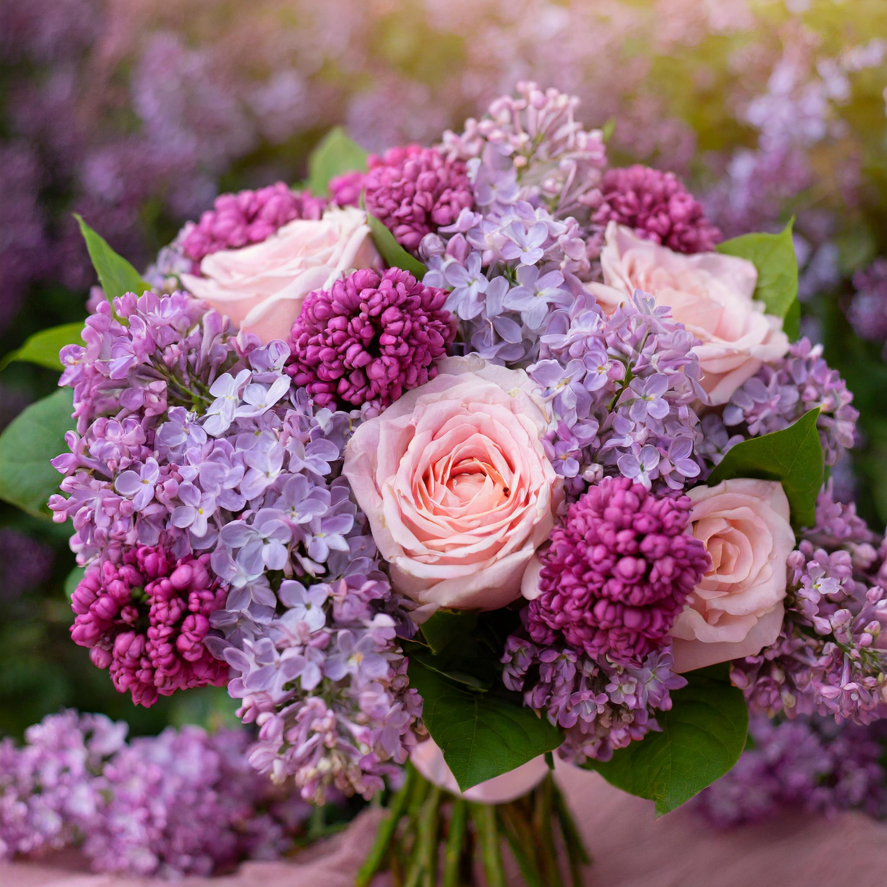

### A Very Important Presentation

A young man was once preparing for a significant presentation. He had to present a bouquet to his elder florist! Now, he could not just throw any random flowers in a basket and present them as his own. Every aspect, from the choice of the basket to the color of the flowers and the shape of the bouquet, had to be carefully considered in this endeavor. 

#### *A Very Important Presentation*

*I was once preparing for a significant presentation. I had to present an outline of a web application to my teaching professor! Now, I knew I could not just throw together any random set of pages in a website and present it as my own. Every aspect from the choice of the application platform, the functionality of the code, and the choice of design patterns were all to be carefully considered in this endeavor.*

### The Choice of Theme

The young man knew that he needed to pick a theme for his flowers that would truly amaze not just anyone, but his elder as well. So many options were available that he did not know which to pick! After considering his choices with his companions and drawing inspiration from other examples, he realized that the bouquet itself was not the entire presentation. The surrounding landscape, time of day, and even the mood of the presentation all play an important role in elevating the bouquet to a level of wonder.

#### *The Choice of Theme*

*I knew that my application needed to contain a general framework for the project that would impress not only my peers but my professor as well. There were so many potential application ideas to pick from! After considering my choices with my peers and drawing inspiration from other template applications, I realized that the application itself was not the entire project. The project's goal, the application's purpose, and even the structure of the website all play an important role in elevating the application to a level of appreciation.*

### Picking a Pattern

The young man was not the first to undergo this trial. Many other florists had come before him and decided for themselves the best flowering patterns for each type of bouquet while leaving their notes behind. Taking these notes into account, the young man began to formulate his plan for constructing the best bouquet pattern for his specific theme. The young man knew that many recorded flower patterns can be used in a variety of different settings. He planned to present his creation at night, so he leaned towards choosing a darker-colored set of flowers.

#### *Picking a Pattern*

*I knew I was not the first student to develop a web application. Many other software developers had come before me and decided for themselves the best design patterns for their specified application while leaving their documentation behind. Taking these records into account, I began researching how I could use these design patterns to help resolve my software design choices in the development of my application. I knew that design patterns are solutions developed by experienced software engineers to solve many common problems in software development. I planned to use some of these design patterns to structure my application in a concise and intuitive way, so I could create something truly exceptional.*

### Working Out the Specifics

The young man wanted to have a prominent flower in the middle of the bouquet. He would also consider having the flower colors alternate like the tiling of a floor. Other than this, the young man pondered hard and long about many design choices. However, as he was still inexperienced with design patterns, he could not find a pattern that really resonated with him and his presentation.

#### *Working Out the Specifics*

*I wanted to use a singleton design pattern by creating an authentication manager for users, which would manage user authentication. This class would have only one instance which provides a global point of access to log into the web application. I also wanted to use an observer design pattern by creating a class where resource availability can be automatically observed and updated by the observer. This would provide users with immediate feedback when a resource from the application becomes available in real time. However, as I was still inexperienced with software design patterns, it was incredibly challenging to find a pattern that perfectly applied to my specific project.*

### The Final Realization

Through all of this searching and agonizing over the right pattern to use, the young man suddenly had a realization. He could plan out the setting, time, and even pattern for his presentation of the bouquet, but it was still up to him to prepare the flowers. Without the flowers of the bouquet, there would be no final product at all. In the end, putting effort into caring for the flowers themselves really overcame all other roadblocks to making the presentation extraordinary.

#### *The Final Realization*

*Through all of this searching and agonizing over the right design pattern to use, I had a realization. I could plan out each design pattern that I should be using in my application, but in the end, it was still up to me to write the code that is tailored towards my specific project. Without the specific code that applies to my application, there would be no final product at all. In the end, putting effort into writing clean and robust code really became the core of what makes my application extraordinary.*

### **Now that I have my foundation, it is time to construct the prettiest project of my journey.**

