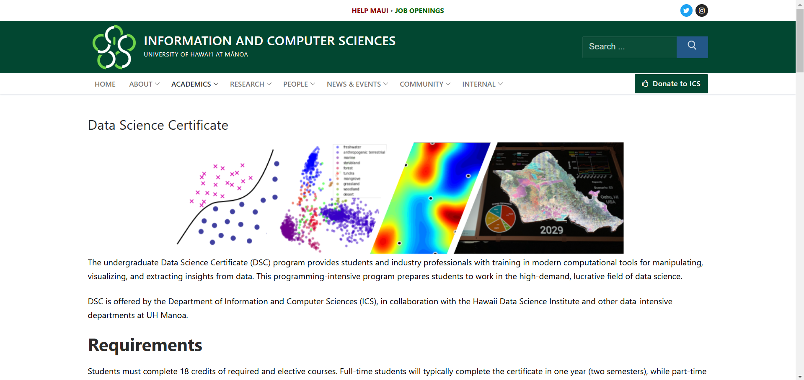
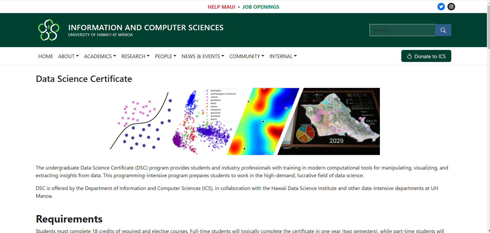

**Extending one's html/css Arsenal**

I have been working with html ever since my first foray into coding. Creating a website was the normal final project of the school year, where everyone created a structured html page and styled it with css code in another file, and maybe some javascript modifications as well. Although it was not very technically challenging, it was tedious to repeatedly style my text containers with css using the same set of extended css code. I was surprised at how long my css code turned out to be by the end of the project. Frameworks were out of the question, as I had very little knowledge of how they worked, although I knew they existed. Before this month, I had never used front-end software development frameworks and was unsure of their purpose in coding, or why there are so many of them. However, now that I have used them to construct my page, I understand their significance in the tech industry.  

**The Problem with Raw Implementation**

From my final project completed in my time before college, I knew how long css code could get in terms of the number of lines. At that time, I didn't mind it as it was just a simple multipage website project with myself deciding whether something looked good enough or not. Since my rubric was my standard, I didn't mind spending extra time writing out all the extra lines of code for a better-looking website or text. Now that I've gained a good deal of experience, I understand that there are many cases where the person who decides if one's work is good enough is not the one who creates the page. In fact, they are likely to have a strict set of guidelines not just for a single webpage, but also for tens if not hundreds of web pages depending on the scope of the company-wide project. In this case, efficiency is very important as the overall image of the website is valued above each individual page, and the time for constructing each individual page with ordinary, raw tools may be very time-consuming. I experienced this just from copying the layout of the UH Mānoa information page for the Data Science Certificate. Without using an html/css/JS framework like Bootstrap, I would have to include a sizeable css file.

**Lifting one's Work up by the Bootstraps**

Bootstrap 5 allows a programmer to easily create appealing websites and web applications without engaging with css code. In my process of learning how to use Bootstrap 5, I was surprised at not having to write a single line of code in my css file. css functionality was automatically implemented with built-in html styles that I put inside of my html code. By providing the user with pre-built html, css, and JS components as classes within html and more, the process of creating awesome webpages is greatly streamlined. Although learning and getting familiar with different UI frameworks may be a time-consuming endeavor in the beginning, as one pivots themself into the realm of UI development the boons they provide in terms of efficiency and consistency are unmatched compared to raw code. Actions once thought of as impossible to achieve in a set amount of time can be done easily with your choice of a UI framework, which is why I think of the name "Bootstrap 5" as fitting for its purpose. I have not mentioned which screenshot is of the original and which screenshot is of my recreation yet, so if you decide to check out the original website, you may decide for yourself which one is of a better design. Thanks to this discovery of these frameworks and Bootstrap 5, I am able to easily take my website designs to the next level.
