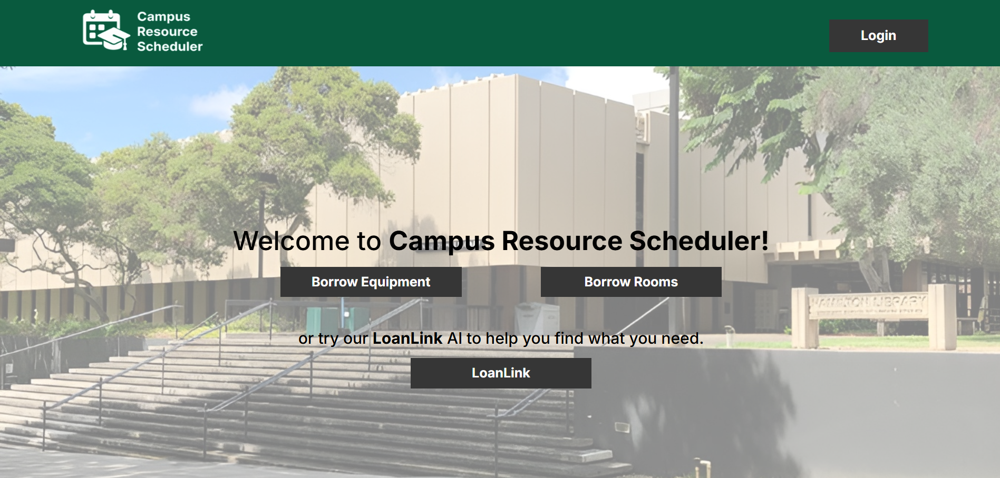

The Campus Resource Scheduler (CRS) was an application I develope with 4 other students over the course of my Software Engineering class. Here is the [GitHub Page](https://campus-resource-scheduler-project.github.io/) and the [GitHub Organization](https://github.com/campus-resource-scheduler-project) for the project. 

## Overview

As a part of the University of Hawai'i (UH) community, this project team wanted to solve a problem common to all students attending school on a UH campus - where to borrow a resource that they will need for some time? The Campus Resource Scheduler or CRS application aims to solve this problem by providing a central hub of both physical resources and locational resources to any UH community member who may need it for a set time. This system stores an online database of available resources that users can choose from, pick up at a specified location, and return to the same location. 

Many applications of the CRS apply to the everyday lives of UH community members. Individuals who forgot to bring an important piece of equipment such as a writing utensil can use the CRS to quickly and easily borrow that piece of equipment for use and return it later. Additionally, individuals who may be going to a special or important event such as an exam can also use the CRS to retrieve an essential resource that they need for that event. Furthermore, physical spaces such as study rooms and labs are also covered by the CRS, so that UH community members who are looking for a space to complete a particular task can effortlessly rent the space for a set period of time. The CRS at its core aims to serve the UH community through providing an easy-to-use interface for borrowing all sorts of items related to academic life.

Users who engage with the CRS application will be able to customize their profile, quickly search for relevant resources to borrow, and see all the relevant details that are attributed to each resource, such as category, location, campus, appearance, and the date that it was made available. The user will also be able to filter through all of these classifications and find the resource that they most need. Additionally, there is a helper AI chatbot that will direct the user towards relevant resources to borrow based on their profile and what the user needs at that time. On the whole, the Campus Resource Scheduler will be able to suit the needs of any UH community member who is looking for a specific campus resource.

## My Role

My role in this project was to manage the overall direction of the project through creating issues in each of the 3 project phases ([M1](https://github.com/orgs/campus-resource-scheduler-project/projects/1), [M2](https://github.com/orgs/campus-resource-scheduler-project/projects/2), [M3](https://github.com/orgs/campus-resource-scheduler-project/projects/4)) for the team members to complete. I also wrote and finalized all of the documentation on the GitHub page regarding the project overviews, mockup page ideas, user guide, developer guide, and community feedback sections. Within the team, I also directed each team member for guidance on how the User Interface (UI) of each page should look like. As the primary project manager and the leader for design choices, I made decisions that decided how the application would look like and what functionality it would have. In addition, I also was responsible for creating the "Your Resources" page within the application.

## Lessons Learned
